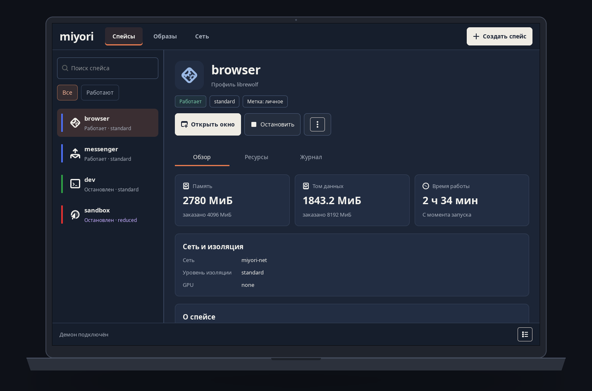

# MiyoriOS

Каждое недоверенное приложение живёт в своей виртуальной машине, а его окно
стоит на обычном рабочем столе рядом с остальными. Браузер не видит мессенджер,
мессенджер не видит рабочие файлы, и ни один из них не знает вашего IP-адреса.

Это слой поверх **существующей** Ubuntu с композитором niri — не отдельный
дистрибутив. Ставится в работающую систему, снимается тоже.



## Что происходит на самом деле

Приложение запускается внутри лёгкой KVM-виртуалки — здесь она называется
**спейс**. У спейса свой диск, своё ядро, свой uid на хосте и ровно один канал
наружу: vsock до хоста. Сетевой карты, разделяемых каталогов и доступа к
композитору у него нет.

Окно доезжает до экрана через **waypipe** поверх vsock. Хост отдаёт гостю
отдельный сокет Wayland, выписанный через `security-context-v1`, — поэтому
композитор знает, что клиент недоверенный, и не выдаёт ему привилегированные
протоколы: снимков экрана и чужих заголовков окон спейс не получит.

Весь IP-трафик спейсов уходит в отдельную виртуалку **miyori-net**. В рабочем
режиме физическая сетевая карта отдана ей целиком через VFIO — у хоста её
больше нет. Спейсы видят только её, она видит только туннель. Если туннель
падает, трафик не идёт никуда — а не наружу открытым текстом.

Над окном спейса висит **полоса доверия**: имя спейса и его цвет. Метку
назначает хост по CID виртуального сокета — гость не может ни выбрать её, ни
подделать.

## Из чего собрано

| | |
|---|---|
| `components/daemon` | `miyorid` — единственный процесс с root: создаёт спейсы, поднимает QEMU, раздаёт tap-интерфейсы |
| `components/manager` | GTK-окно на снимке выше: список спейсов, сборка образов, состояние сети |
| `components/guid` | брокер GUI: принимает соединения гостей на vsock-порту 1700 и запускает для каждого waypipe в песочнице |
| `components/label` | полоса доверия над окном спейса |
| `components/agent` | то, что работает внутри гостя и отвечает хосту |
| `components/net` | сетевая виртуалка: сборка образа, VFIO, правила, киллсвитч |
| `components/killswitch` | хостовая часть: закрытый IPv6, DNS только через резолвер сетевой машины |
| `components/waypipe` | сборка waypipe из зафиксированного тега — пакетный не умеет vsock |
| `lib/` | протокол управления, конфиг, разбор профилей, песочница |
| `profiles/` | манифесты образов: из чего собирать спейс под конкретное приложение |
| `tests/` | три батареи проверок, см. ниже |

Всё на Rust stable, каждый крейт с `#![forbid(unsafe_code)]`. Зависимости
вендорены в `third_party/crates` — сборка идёт `--offline`, новый крейт
добавляется решением, а не привычкой: привилегированный код, всё попадает в
доверенную базу.

## От чего это НЕ защищает

Читать обязательно. Инструмент, который выглядит готовым там, где он не готов,
хуже отсутствующего.

- **Побег из KVM/QEMU или из хостового waypipe.** Изоляция ровно настолько
  прочна, насколько прочен гипервизор.
- **Скомпрометированный хост.** Root на хосте читает память и диски всех VM.
  Здесь нет защиты от хозяина машины.
- **Компрометация `miyori-net`.** Сетевая машина видит трафик всех спейсов до
  шифрования и хранит ключи туннеля у себя открытым текстом. Кто получил
  её — получил и то и другое.
- **Общий буфер обмена.** Скопированное в одном спейсе вставляется в другом:
  канал между спейсами существует и не закрыт. Фоновое чтение буфера закрыто —
  без фокуса и без вашего действия спейс его не прочитает.
- **Перехват фокуса.** Спейс может вытащить своё окно наверх в момент, когда вы
  печатаете в чужом. Снимков экрана и чужих заголовков он при этом не получает.
- **Перехват горячих клавиш.** Пока окно спейса в фокусе, оно может подавить
  биндинги композитора.
- **Деанонимизация приложения.** Отпечаток браузера, логины, куки, поведение —
  это не про сеть, и сеть этого не лечит. Спейс к тому же видит число мониторов
  и их геометрию.
- **Сокрытие факта виртуализации.** Гость видит артефакты KVM и пользуется
  vsock. Обещано только отсутствие IP-доступа к хосту и соседям.
- **Атаки на железо и прошивки, side-channel класса Spectre между VM.**
- **Вас самих.** Если секрет вставлен в недоверенное окно или заражённый файл
  открыт вручную — система тут ни при чём.

Про выход в сеть отдельно: трафик уходит на ваш VPS, и **VPS видит все имена и
все адреса назначения**. Это не «анонимность», это смена того, кому вы
доверяете: вместо провайдера — арендованный сервер.

## Что проверено, а что нет

Свойство считается обеспеченным только после прохождения своей проверки. Не
«должно работать» — а `PASS` на стенде.

```
tests/verify/     изоляция GUI, песочница waypipe, привилегированные
                  Wayland-глобалы, подделка заголовка окна, враждебный
                  ввод на сокете управления
tests/net/        выход только через miyori-net, изоляция соседей,
                  недостижимость хоста и его LAN, поведение при падении
                  туннеля, закрытый IPv6, отсутствие утечки DNS
tests/lifecycle/  create/start/stop/destroy настоящего спейса, полоса
                  доверия на каждом выходе, отсутствие «мёртвых» окон,
                  шифрование диска, nonce агента
```

Часть проверок требует живого стенда и root — они это говорят при запуске и
сами не запускаются. Сетевая батарея поднимает фикстуру в сетевом namespace,
поэтому её можно гонять, не трогая рабочую сеть.

Открытым остаётся: буфер обмена между спейсами, перехват фокуса, модель
шифрования дисков за пределами baseline.

## Требования

- Ubuntu с композитором **niri**, поддерживающим `security-context-v1`
- **QEMU/KVM** с `microvm`, `vhost-vsock-device`, `virtio-gpu-device`
- в ядре `vhost_vsock`; для тестов брокера — `vsock_loopback`
- **Rust stable** (версия зафиксирована в `rust-toolchain.toml`)
- `mmdebstrap` для сборки образов и `nftables`
- отдельная сетевая карта в своей IOMMU-группе — в режиме `vfio` она уйдёт
  сетевой машине целиком, и хост останется без неё
- VPS с туннелем, если нужен выход в сеть

waypipe из репозиториев дистрибутива **не подходит** — в 0.8 нет ни `--vsock`,
ни `--secctx`. Собирается из зафиксированного тега: `components/waypipe/build.sh`.

## Установка

```sh
# 1. собрать всё
cargo build --release --workspace --locked --offline
bash components/waypipe/build.sh

# 2. собрать образ спейса по манифесту (без root, mmdebstrap в unshare)
bash tools/build-profile.sh profiles/dev

# 3. поставить бинари, юниты и правило tmpfiles
sudo bash install/install-system.sh
```

Установщик включает автозапуск, но **ничего не запускает сам** — если стенд уже
поднят руками, переключаться на systemd-версию вы должны осознанно:

```sh
sudo systemctl start miyorid
systemctl --user start miyori-guid miyori-label
```

Сетевая машина отдельно и тоже вручную: отдать карту в VFIO и остаться без сети
хост должен по команде, а не по факту загрузки.

```sh
sudoedit /etc/miyorios/miyori-net.env     # режим аплинка, адрес карты, имя интерфейса
sudo systemctl start miyori-net-uplink    # карта уходит в VFIO (только при MIYORI_UPLINK=vfio)
sudo systemctl start miyori-net           # консоль машины — journalctl -fu miyori-net
```

Обратный путь — `sudo systemctl stop miyori-net miyori-net-uplink
miyori-net-fixture`, карта возвращается хосту. Снять всё целиком —
`sudo bash install/uninstall-system.sh`; реестр спейсов и их диски он не трогает.

Дальше — менеджер: «MiyoriOS Manager» в меню приложений.

## Свои приложения

Спейс описывается манифестом `profiles/<id>/manifest.toml`: дистрибутив,
пакеты, точка входа, память, диск, уровень изоляции. Каталог `overlay/`
кладётся поверх образа как есть. Имя каталога обязано совпадать с `id`.

```toml
id = "notes"
description = "Заметки в своём спейсе"

[base]
builder  = "mmdebstrap"
suite    = "noble"
packages = ["systemd-sysv", "iproute2", "linux-image-virtual", "foot"]

[app]
mode    = "app"
command = "/usr/local/bin/miyori-app"

[resources]
memory_mb = 2048
cpus      = 2
disk_gb   = 8
```

Рабочие примеры — рядом в `profiles/`.

## Состояние

Ранняя разработка, одна проверенная машина. Интерфейс управления и имена команд
ещё меняются.

Если собираетесь на этом что-то защищать: сначала прочитайте раздел «от чего это
НЕ защищает», потом прогоните проверки на своей машине, и только потом решайте.

## Лицензия

На выбор: [MIT](LICENSE-MIT) или [Apache-2.0](LICENSE-APACHE). Берите ту, что
удобнее; Apache-2.0 к тому же даёт явный патентный грант.

Исходники waypipe сюда не входят — в `components/waypipe/` лежат только
зафиксированный тег и патч к нему, и на них распространяются условия самого
waypipe. Зависимости Rust вендорены в `third_party/crates/` со своими
лицензиями; их список проверяет `cargo deny` в CI.
